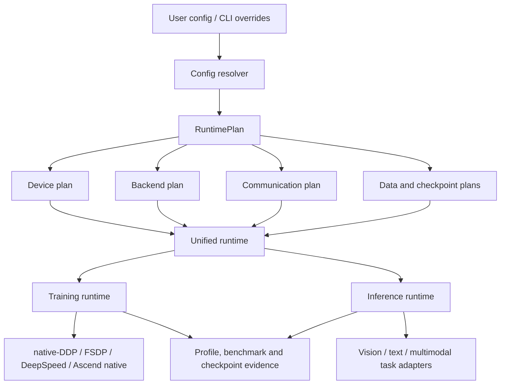

<div align="center">

# ParaScale

**面向视觉与多模态场景的分布式训练和推理控制层**

统一配置、运行计划、训练后端、数据管线、性能分析与 checkpoint/resume，
让百卡以下集群上的模型开发更容易运行、比较和复现。

[特性](https://github.com/WangJunWJJ/ParaScale#%E7%89%B9%E6%80%A7) ·
[安装](https://github.com/WangJunWJJ/ParaScale#%E5%AE%89%E8%A3%85) ·
[快速开始](https://github.com/WangJunWJJ/ParaScale#%E5%BF%AB%E9%80%9F%E5%BC%80%E5%A7%8B) ·
[文档](https://github.com/WangJunWJJ/ParaScale#%E6%96%87%E6%A1%A3) ·
[示例](https://github.com/WangJunWJJ/ParaScale#%E7%A4%BA%E4%BE%8B) ·
[API 参考](https://github.com/WangJunWJJ/ParaScale#api%E5%8F%82%E8%80%83) ·
[架构设计](https://github.com/WangJunWJJ/ParaScale#%E6%9E%B6%E6%9E%84%E8%AE%BE%E8%AE%A1) ·
[测试](https://github.com/WangJunWJJ/ParaScale#%E6%B5%8B%E8%AF%95) ·
[版本历史](https://github.com/WangJunWJJ/ParaScale#%E7%89%88%E6%9C%AC%E5%8E%86%E5%8F%B2) ·
[许可证](https://github.com/WangJunWJJ/ParaScale#%E8%AE%B8%E5%8F%AF%E8%AF%81)

</div>

> **试用版提示**
>
> ParaScale 正处于公开试用前期。当前版本适合架构评估、功能验证和受控训练实验；生产使用前，请根据目标模型、数据集、硬件和训练窗口完成同口径验收。

ParaScale 不重新实现 PyTorch、FSDP 或 DeepSpeed，而是在成熟计算后端之上提供一条可审查的工程主线：

```text
config -> resolve -> plan -> train / infer -> profile -> benchmark -> checkpoint / resume
```

框架优先服务 CLIP-style 对比学习、VLM LoRA、视觉模型训练和视觉/多模态推理。它的差异化重点是数据管线、可解释策略选择、同口径后端比较和训练恢复闭环，而不是堆叠模型专用脚本。

## 特性

### 一个入口完成完整工作流

ParaScale 使用统一 CLI 管理环境诊断、策略规划、训练、推理、服务、性能测试与 checkpoint 校验：

```bash
python -m parascale.cli doctor
python -m parascale.cli plan --config <config>
python -m parascale.cli train --config <config>
python -m parascale.cli infer --config <config>
python -m parascale.cli benchmark-matrix --scenario <scenario>
python -m parascale.cli checkpoint validate --checkpoint <path>
```

### 面向真实训练工程

- **统一配置解析**：合并用户配置、CLI override、workload、backend 和硬件信息，输出可追溯的最终配置与运行计划。
- **多训练后端**：支持 native、native-DDP、FSDP 和 DeepSpeed；根据吞吐、显存和稳定性目标选择执行路径。
- **视觉与多模态数据管线**：提供 batching、collation、缓存、worker 预处理、异步 prefetch 和数据等待 profile 能力。
- **可解释策略规划**：结合静态配置和 runtime profile 给出后端、精度、batch、通信和 dataloader 建议，并保留选择依据。
- **可靠 checkpoint**：提供 manifest、校验、rank-aware 保存、resume 和 adapter-only checkpoint 基础能力。
- **训练与推理共用基础设施**：设备、collective、数据 schema、运行计划和 checkpoint contract 在同一工程内复用。
- **同口径 benchmark**：在相同模型、数据、batch budget 和硬件上比较 native-DDP、FSDP 与 DeepSpeed。
- **GPU/NPU 统一抽象**：CUDA/NCCL 与 Ascend NPU/HCCL 使用同一 runtime 边界，环境和运行示例分别组织。

### 当前能力边界

| 能力 | 当前状态 | 使用建议 |
| --- | --- | --- |
| 单机 native / native-DDP | 已完成选定视觉、多模态路径实机验证 | 中小规模、吞吐优先场景的候选路径 |
| FSDP / DeepSpeed | 已完成 smoke 和选定场景验证 | 大模型、显存压力、ZeRO/offload 的成熟 fallback |
| checkpoint / resume | 已完成选定训练路径闭环验证 | 正式长训前仍需按目标 workload 做中断恢复测试 |
| benchmark / profile / tuner | 已形成统一入口 | 结论只适用于同硬件、同数据和同配置口径 |
| 推理 runtime | 通用骨架及选定任务 smoke 可用 | 生产 serving 仍需真实模型 adapter 与长窗口验收 |
| Ascend NPU / HCCL | 架构与示例入口就绪 | 当前不声明生产可用，需在目标 CANN/torch_npu 环境实机验收 |
| TP / PP / native ZeRO | 规划原语或有限能力 | 不作为当前试用版的生产并行主路径 |

## 安装

### 环境要求

- Python 3.10 或更高版本
- PyTorch 2.4 或更高版本
- Linux 推荐用于 CUDA、NCCL、DeepSpeed 和 Ascend 分布式运行
- NVIDIA GPU 环境需预先配置匹配的驱动、CUDA 与 NCCL
- Ascend 环境需预先配置匹配的 CANN、`torch_npu` 与 HCCL

建议先由硬件环境提供方安装匹配设备的 PyTorch，再安装 ParaScale，避免 pip 自动选择与驱动不匹配的 wheel。

### 从源码安装

```bash
git clone https://github.com/WangJunWJJ/ParaScale.git
cd ParaScale

python -m venv .venv
source .venv/bin/activate
python -m pip install --upgrade pip
pip install -e .
```

Windows PowerShell 激活虚拟环境：

```powershell
.\.venv\Scripts\Activate.ps1
pip install -e .
```

### 可选依赖

按实际场景安装，不必一次安装全部依赖：

| 场景 | 安装命令 |
| --- | --- |
| DeepSpeed | `pip install -e ".[deepspeed]"` |
| DataComp / WebDataset | `pip install -e ".[datacomp]"` |
| VLM LoRA | `pip install -e ".[vlm]"` |
| YOLO / detection | `pip install -e ".[yolo]"` |
| Ascend NPU | `pip install -e ".[ascend]"` |
| 本地开发与测试 | `pip install -e ".[dev]"` |

安装后先检查运行环境：

```bash
python -m parascale.cli doctor
```

## 快速开始

下面的流程使用仓库内置 tiny workload，不需要下载模型权重或数据集，用于验证配置、runtime、训练和 checkpoint 主链路。

### 1. 检查环境

```bash
python -m parascale.cli doctor
```

`doctor` 会报告 Python、PyTorch、设备以及可选后端依赖状态。

### 2. 查看运行计划

```bash
python -m parascale.cli plan \
  --config configs/quickstart/tiny_torch.yaml
```

需要完整机器可读计划时：

```bash
python -m parascale.cli plan \
  --config configs/quickstart/tiny_torch.yaml \
  --json
```

### 3. 预览训练

```bash
python -m parascale.cli train \
  --config configs/quickstart/tiny_torch.yaml \
  --dry-run
```

`--dry-run` 只解析和验证配置，不启动真实训练。

### 4. 执行最小训练

```bash
python -m parascale.cli train \
  --config configs/quickstart/tiny_torch.yaml
```

该配置执行 2 个 step，并将 checkpoint 写入 `runs/quickstart/tiny_torch/`。

### 5. 校验 checkpoint

```bash
python -m parascale.cli checkpoint validate \
  --checkpoint runs/quickstart/tiny_torch
```

至此完成最小闭环：环境可见、配置可解析、计划可解释、训练可执行、checkpoint 可校验。

### 6. 预览后端矩阵

真实 benchmark 前可先生成矩阵配置，不启动训练进程：

```bash
python -m parascale.cli benchmark-matrix \
  --scenario vlm-lora-hf-clip \
  --backends native_ddp fsdp deepspeed \
  --dry-run
```

正式对比必须保持模型、数据、全局 batch、精度、warmup、measurement window 和硬件一致。ParaScale 不将 synthetic、dry-run 或短 smoke 结果作为性能领先证据。

## 文档

| 文档 | 内容 |
| --- | --- |
| [软件设计文档](docs/software_design_documentation.md) | 产品目标、总体架构、模块边界和演进路线 |
| [软件需求规格说明](docs/software_requirements_specification.md) | 功能需求、能力等级、验收标准和未完成项 |
| [ResolvedConfig 设计](docs/resolved_config_design.md) | 配置来源、覆盖规则、冻结与审计输出 |
| [架构收口设计](docs/architecture_closure_design.md) | 核心目录职责、兼容壳清理和推理入口边界 |
| [远程服务器测试指南](docs/remote_server_test_guide.md) | 容器化 GPU 测试、同步和验证建议 |
| [统一测试与 benchmark 报告](tests/UNIFIED_TEST_BENCHMARK_REPORT.md) | 历史测试方法、结果口径与迭代记录 |

## 示例

`examples/` 按硬件环境组织。每个示例目录包含：

- `config.json`：一次运行所需的完整配置；
- `run.sh`：调用统一 ParaScale CLI 的薄启动脚本；
- `README.md`：依赖、模型路径和运行说明。

### GPU 示例

```bash
bash examples/gpu/example_001_clip_tiny_native/run.sh
bash examples/gpu/example_002_vision_synthetic_native/run.sh
```

真实权重推理示例：

```bash
bash examples/gpu/example_003_clip_real_inference/run.sh
bash examples/gpu/example_004_yolo_world_real_inference/run.sh
```

### Ascend 示例

```bash
bash examples/ascend/example_001_tiny_ascend_native/run.sh
bash examples/ascend/example_002_tiny_native_ddp_hccl/run.sh
```

CLIP 与 YOLO-World 推理配置位于 [`examples/ascend/`](examples/ascend/)。运行前请根据目标服务器修改数据集和模型权重路径。框架核心不会保存用户运行产生的 checkpoint、数据集或报告。

完整说明见 [examples/README.md](examples/README.md)。

<a id="api参考"></a>

## API 参考

### CLI

| 命令 | 作用 |
| --- | --- |
| `doctor` | 检查设备、PyTorch 和可选依赖 |
| `plan` | 解析配置并生成可解释 RuntimePlan |
| `train` | 启动训练或执行 dry-run |
| `infer` | 执行一次性推理 workload |
| `serve` | 启动 serving runtime |
| `benchmark` | 执行单项 benchmark |
| `benchmark-matrix` | 执行统一后端对照矩阵和 OOM retry |
| `benchmark-stability` | 执行长窗口与恢复稳定性测试 |
| `vision-profile` | 分析真实图像目录的数据管线 |
| `checkpoint validate` | 校验 manifest 与 checkpoint payload |

查看全部命令和参数：

```bash
python -m parascale.cli --help
python -m parascale.cli <command> --help
```

### Python API

ParaScale 从顶层包导出稳定的配置、计划、设备、数据、训练、推理和 checkpoint 类型：

```python
from parascale import (
    CheckpointManager,
    ParaScaleConfig,
    RuntimePlan,
    TrainEngine,
    build_strategy_plan,
)
```

主要命名空间：

| 命名空间 | 职责 |
| --- | --- |
| `parascale.config` | 用户配置、分层配置和 ResolvedConfig |
| `parascale.contracts` | 跨模块稳定计划与 workload 协议 |
| `parascale.core` | CPU、CUDA、Ascend 设备和 collective 抽象 |
| `parascale.data` | 视觉、多模态 batching、cache 和 profile |
| `parascale.strategy` | 静态规划、OOM fallback 和 runtime tuner |
| `parascale.runtime` | 训练、推理、launcher 与 backend 执行 |
| `parascale.checkpoint` | manifest、保存、恢复、校验与转换计划 |
| `parascale.serving` | batching、调度、KV cache 与服务编排 |

当前试用版仍可能调整 Python API；用户工作流应优先使用统一 CLI 和配置文件。

## 架构设计

ParaScale 将“硬件设备”和“训练策略”分层：CUDA/Ascend 负责设备能力，native-DDP/FSDP/DeepSpeed 负责训练执行。workload 只保留模型与任务适配，通用数据处理、设备迁移、checkpoint 和 profile 位于框架核心。



核心目录：

```text
parascale/
  commands/            # CLI 命令实现
  config/              # 配置加载、解析、追踪和持久化
  contracts/           # 跨模块稳定协议
  core/                # device、collective、topology
  data/                # 通用视觉与多模态数据能力
  runtime/
    backends/           # native、FSDP、DeepSpeed、Ascend backend
    training/           # 训练循环、step、accumulation、checkpoint
    inference/          # 通用推理 runtime 与任务 registry
  workloads/           # 薄 workload adapter
  strategy/            # 规划、profile feedback、OOM retry
  checkpoint/          # checkpoint contract 与管理器
  serving/             # 推理服务编排
```

架构决策遵循三项约束：contracts 不进入高频热路径；多机是一级目标但按验证等级声明；所有硬件特性通过通用 runtime 接口扩展，不在核心代码中累积模型 patch。

## 测试

安装开发依赖并运行完整本地测试：

```bash
pip install -e ".[dev]"
python tests/run_tests.py
python -m ruff check parascale tests setup.py
```

分布式、GPU/NPU、真实数据和真实权重验证应在隔离容器或测试节点执行。推荐记录以下信息：

- commit、镜像和依赖版本；
- 模型、数据集、精度、全局 batch 和梯度累积；
- warmup、measurement steps、吞吐和 peak memory；
- dataloader wait、失败率和 checkpoint/resume 结果；
- backend 选择原因及同口径对照结果。

benchmark 工具、配置和报告统一位于 [`tests/benchmarks/`](tests/benchmarks/)，稳定性验证位于 [`tests/validation/`](tests/validation/)。正式长训容器建议配置充足共享内存，例如 `--shm-size=8g`。

## 版本历史

### 0.1.0 - 试用版

- 重整为 runtime-first 架构，移除旧 Engine 和兼容壳；
- 建立统一 CLI、ResolvedConfig、RuntimePlan 和 backend registry；
- 提供 native-DDP、FSDP、DeepSpeed 训练入口及 Ascend 架构入口；
- 建立视觉/多模态数据管线、profile/tuner 和 benchmark matrix；
- 完成选定路径的 checkpoint/resume、推理和远程双卡 smoke 验证；
- 将用户示例按 GPU 与 Ascend 环境组织。

详细迭代验证记录见 [统一测试与 benchmark 报告](tests/UNIFIED_TEST_BENCHMARK_REPORT.md)。

## 许可证

ParaScale 使用 [MIT License](LICENSE)。你可以在遵守许可证条款的前提下使用、修改和分发本项目。

---

ParaScale 当前最需要的不是更多一次性脚本，而是更多真实模型、真实数据和真实硬件上的可复现反馈。试用时请保留完整配置、环境信息和验证口径，让每一次结果都能推动框架变得更可靠。
